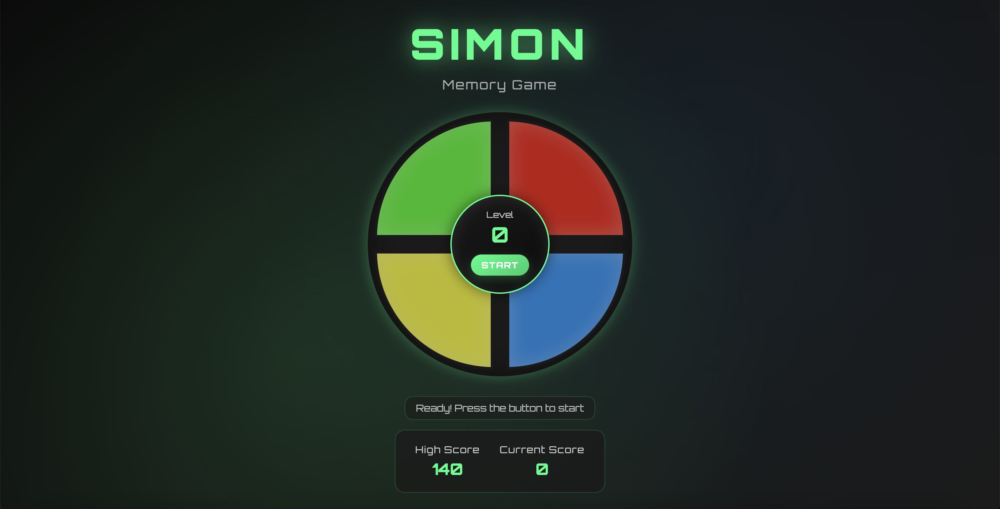
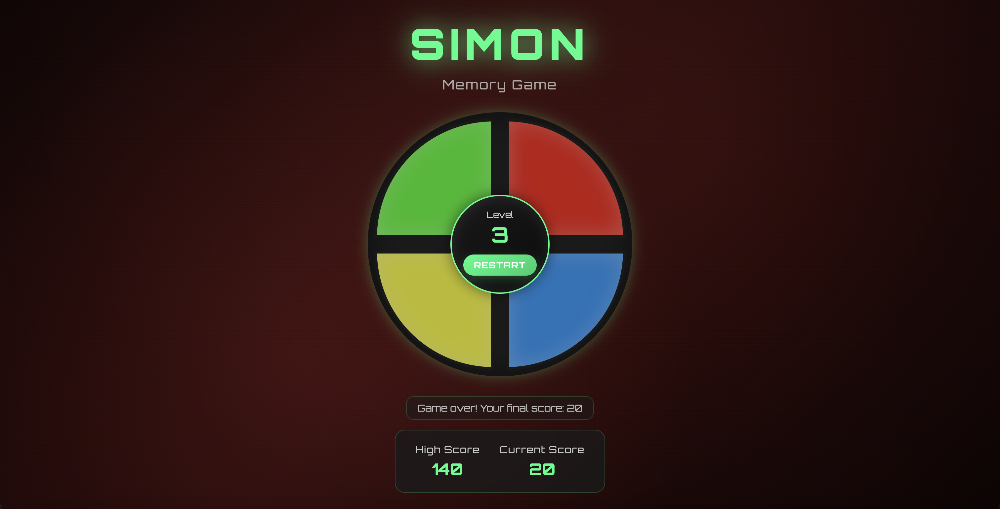
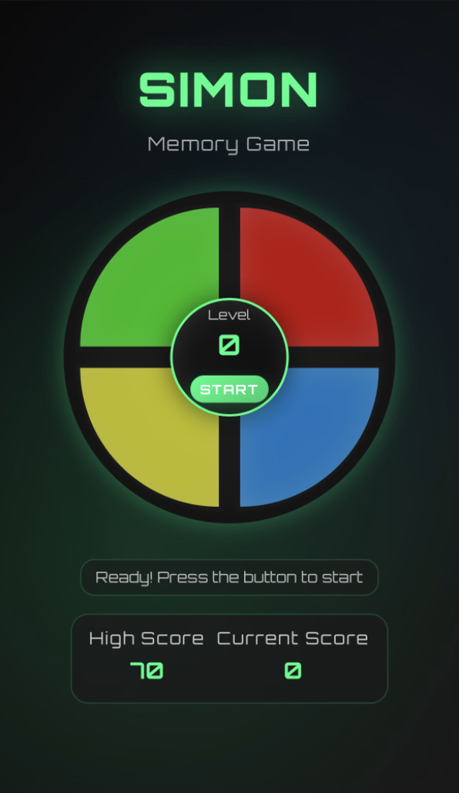
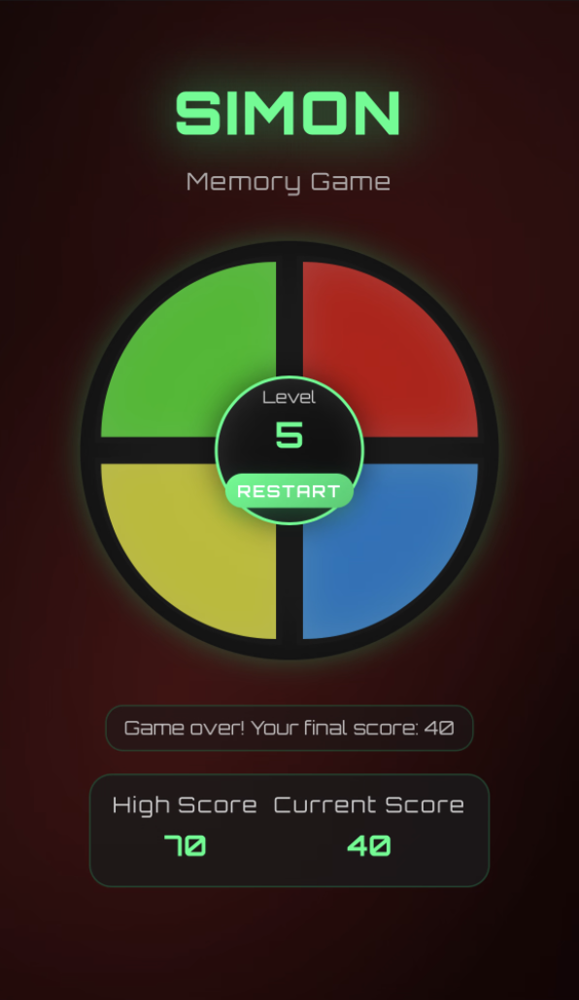

# Simon Game - Modern Implementation

A modern, responsive implementation of the classic Simon memory game with sleek design and smooth animations.

## Live Preview

Experience the game here: [Simon Game - Live Preview](https://omeroztprk.github.io/projects/project2-simon-game-modern/)

## Features

- **Modern UI/UX** - Sleek dark theme with neon accents
- **Fully Responsive** - Optimized for both desktop and mobile devices
- **Web Audio API** - High-quality sound effects for each color
- **Keyboard Support** - Play with keyboard shortcuts (Q, W, A, S, Space)
- **Touch Optimized** - Perfect mobile experience with touch events
- **Progressive Difficulty** - Challenging gameplay with increasing sequence length
- **High Score System** - Local storage to track your best performance
- **Smooth Animations** - CSS transitions and visual feedback

## How to Play

1. Press **START** to begin
2. Watch the sequence of colors light up
3. Repeat the sequence by clicking the colored buttons
4. Each level adds one more color to remember
5. Make a mistake and it's game over!

**Keyboard Controls:**
- `Q` - Green button
- `W` - Red button  
- `A` - Yellow button
- `S` - Blue button
- `Space` - Start/Reset game

## Screenshots

### Desktop Version
<p align="center">
  <a href="screenshots/desktop-game.png" target="_blank">
    
  </a>
</p>
<p align="center">
  <em>Modern desktop interface with glowing effects</em>
</p>

<p align="center">
  <a href="screenshots/desktop-gameover.png" target="_blank">
    
  </a>
</p>
<p align="center">
  <em>Game over state with red theme transition</em>
</p>

### Mobile Version
<p align="center">
  <a href="screenshots/mobile-game.png" target="_blank">
    
  </a>
  <a href="screenshots/mobile-gameover.png" target="_blank">
    
  </a>
</p>

<p align="center">
  <em>Left: Touch-optimized mobile interface</em> &nbsp;|&nbsp;
  <em>Right: Game over screen on mobile</em>
</p>

## Technologies Used

- **HTML5** - Semantic structure
- **CSS3** - Modern styling with custom properties and animations
- **JavaScript (ES6+)** - Game logic and Web Audio API
- **jQuery** - DOM manipulation and event handling

## Installation

1. Clone the repository:
```bash
git clone https://github.com/omeroztprk/simon-game-modern.git
```

2. Open `index.html` in your browser

3. Start playing!

## Design Features

- **CSS Custom Properties** for easy theming
- **Responsive breakpoints** for all device sizes
- **Touch-friendly interactions** with proper event handling
- **Accessibility features** with proper focus states
- **Cross-browser compatibility** with vendor prefixes

---

**Enjoy the game and challenge your memory!**
